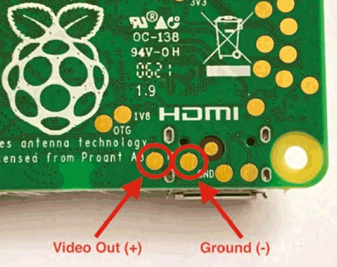
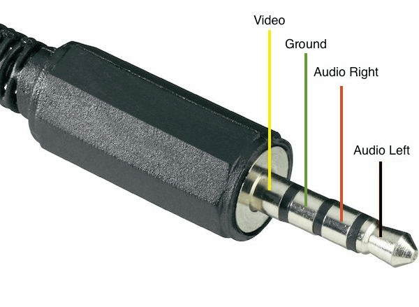

# Composite output on Raspberry PI

It is possible to use Raspberry PI based ground station with FPV glasses which do not have HDMI input.

By default, RPI image is configured to use HDMI output with option in ```config.txt```:

```hdmi_force_hotplug=1```

Composite output can be enabled either by running ```sudo raspi-config``` or by disabling this option: 

```sudo nano /boot/config.txt``` (or edit ```config.txt``` on Windows PC).

With ```hdmi_force_hotplug=0```, Pi will try to output via HDMI. If no HDMI device is detected, it will fall back to composite video.

For Raspberry PI4 it is a little bit different. RPI4 has to be configured either for HDMI or Composite output with option:

```enable_tvout=1```

For composite output, default mode is NTSC. PAL mode can be enabled with:

```sdtv_mode=2```

If image does not fit screen properly, uncomment and use the following options to make adjustments:

```
# uncomment this if your display has a black border of unused pixels visible
# and your display can output without overscan
#disable_overscan=1  

# uncomment the following to adjust overscan. Use positive numbers if console
# goes off screen, and negative if there is too much border
#overscan_left=16
#overscan_right=16
#overscan_top=16
#overscan_bottom=16
```

Note that NTSC is 720x480x60i and PAL is 720x576x50i  (interlaced). Composite can not handle higher modes. "Progessive" modes (``sdtv_mode=16`` and ``sdtv_mode=18``) on RPI are 720x240p and 720x288p.

So:

1) PAL is prefferable
2) There is no sense to use 1024x576 with composite output.

# Pinout

## Raspberry PI Zero 2W 

Raspberry PI Zero 2W does not have composite video connector. It has to be soldered to pads:



## Raspberry PI 4

Raspberry PI 4 requires specific connector:


