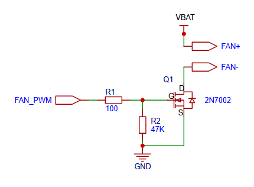
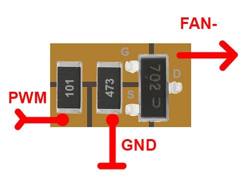
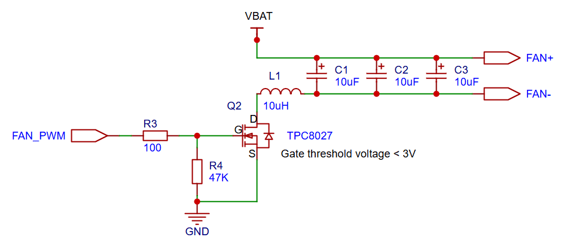
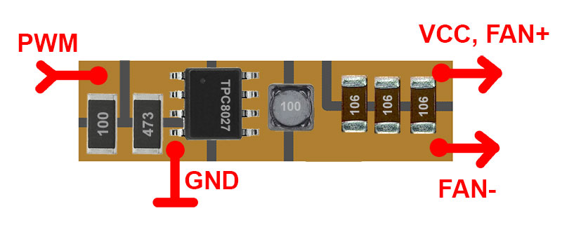

# Connecting Fan

See also:  [Installing Fan Control Service](/doc/installing_fan_control_service.md  ) 

To prevent overheating, it is recommended to install a cooling fan with adjustable speed control.

Fan speed is controlled by a script, which also allows adjustment of the PWM signal frequency.

# 4-wire fan

4-wire 5V fan with dedicated PWM wire does not need additonal schematcs and can be connected directly to +5V and FAN_PWM pin.
 
Fan should be compatible with 3.3 PWM signal.

How to Check Fan Compatibility:
- Connect the fan to +5V power.
- Measure the voltage on the PWM pin — it should be 3.3V or lower.
- If the voltage is within range, connect the PWM wire to FAN_PWM pin and verify if the fan operates correctly.

PWM frequency in the script should be set to 25Hz (default).

# 2-wire fan

A 2-wire fan (or a 3-wire fan with a speed sensor) can be connected in one of the following ways:
- Direct connection to +5V or VBAT for continuous full-speed operation
- Using a basic PWM circuit for simple speed control
- Using an advanced PWM circuit for quiet operation

## Basic PWM Fan speed control schematics

PWM frequency in the script should be set to 25Hz (default). 
Most fans do not operate reliably at PWM frequencies above 50 Hz.
Due to the low frequency, some noise during operation may occur.

## Advanced PWM Fan speed control schematics

PWM frequency in the script should be set to 30000 (30Khz).
This configuration allows the fan to operate quietly.

