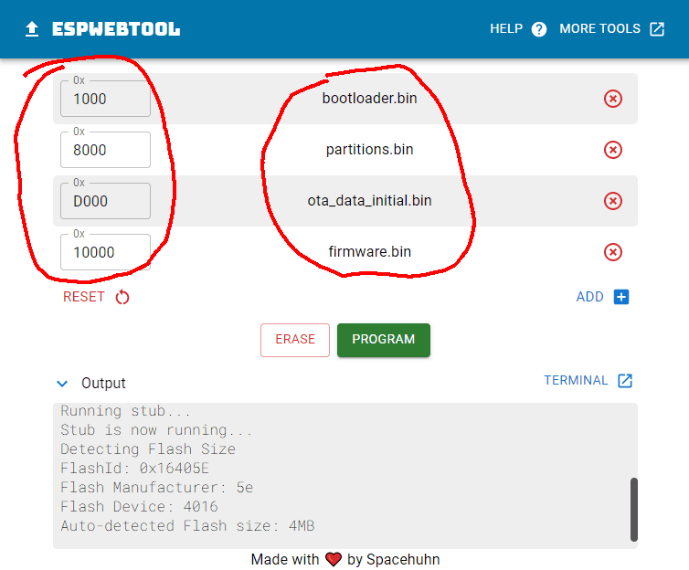
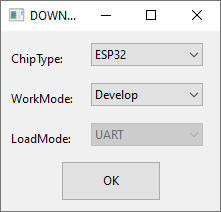
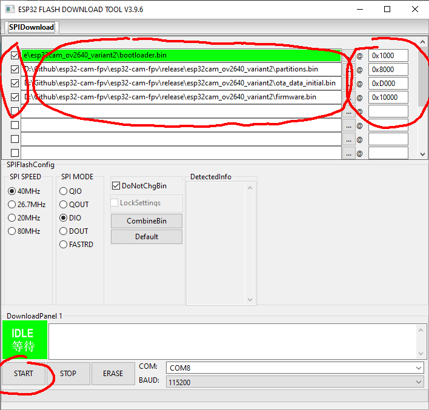

# Flashing esp32cam

**esp32-cam** with **esp32-cam-mb** adapter is recommended.

Experienced users who connect **esp32cam** using USB-UART adapter should enter flashing mode by holding **Boot** button and pressing **Reset** button before starting flashing.

## Flashing using online tool

* Download and uncompress prebuilt firmware files from https://github.com/RomanLut/hx-esp32-cam-fpv/releases
* Navigate to https://esp.huhn.me/
* Connect esp32-cam-mb adapter to USB, click **[Connect]**, select USB UART of **esp32cam**
* Add firmware files as shown on screenshot:
 


* Make sure addresses are filled corectly
* Click **[Program]**

## Flashing using Flash download tool

* Download and uncompress prebuilt firmware files from https://github.com/RomanLut/hx-esp32-cam-fpv/releases
* Download and uncommpress Flash Download tools https://www.espressif.com/en/support/download/other-tools
* Start Flash Download Tools, select esp32:


 
* Connect esp32-cam-mb adapter to USB
* Add firmware files as shown on screenshot:
 


* Make sure checkboxes are selected
* Make sure addresses are filled corectly
* Make sure files are selected in correct order
* Click **[Start]**


## Building and Flashing using PlatformIO

* Download and install PlatformIO https://platformio.org/
 
* Clone repository: ```git clone -b release --recursive https://github.com/RomanLut/esp32-cam-fpv```

* Open project: **esp32-cam-fpv\air_firmware_esp32cam\esp32-cam-fpv-esp32cam.code-workspace**

* Let **PlatformIO** to install all components

* Connect **esp32cam** to USB

* Click **[PlatformIO: Upload]** on bottom toolbar.

# Over the Air update (OTA)

When **esp32cam** is installed on UAV, it would require desoldering to update firmware. 

There is easie alternative way using **Over The Air update (OTA)**. 

Hold **REC** button while powering up to enter **OTA mode**. 

**OTA/Fileserver mode** is indicated by LED blinking with 1 Hz frequency.

* Enter **OTA mode**.
* Connect to **espvtx** access point.
* Navigate to http://192.168.4.1/ota
* Select **firmware.bin** file.
* Click **Upload**

To upload firmware with Visual Studio Code, uncomment "OTA Update" lines in the ```platformio.ini```.
