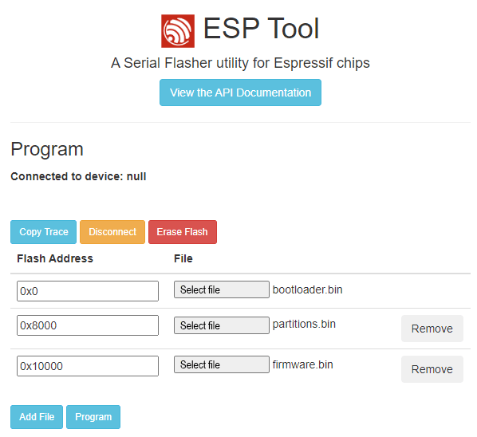
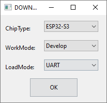
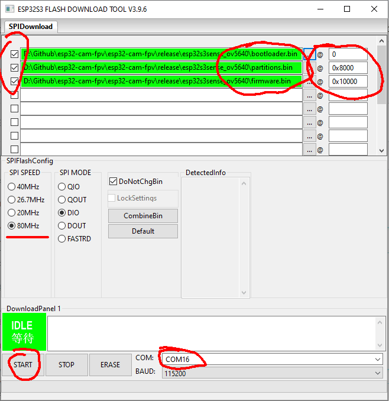

# Flashing esp32s3sense

## Flashing using online tool

* Download and uncompress prebuilt firmware files from https://github.com/RomanLut/hx-esp32-cam-fpv/releases
* Navigate to [https://espressif.github.io/esptool-js/](https://espressif.github.io/esptool-js/)
* Connect **esp32s3sense** to USB, click ```[Connect]```, select ```USB JTAG/serial debug unit``` of **esp32s3sense**
* Add firmware files as shown on screenshot:
 


* Make sure addresses are filled corectly
* Click ```[Program]```

## Flashing using Flash download tool

* Download and uncompress prebuilt firmware files from https://github.com/RomanLut/hx-esp32-cam-fpv/releases
* Download and uncompress **Flash Download tools** https://www.espressif.com/en/support/download/other-tools
* Start **Flash Download Tools**, select ```ESP32-S3```:


 
* Connect **esp32s3sense** to USB
* Add firmware files as shown on screenshot:
 


* Make sure checkboxes are selected
* Make sure addresses are filled corectly
* Make sure files are selected in correct order
* Select correct COM port
* Click ```[Start]```


## Building and Flashing using PlatformIO

* Download and install PlatformIO https://platformio.org/
 
* Clone repository: ```git clone -b release --recursive https://github.com/RomanLut/esp32-cam-fpv```

* Open project: ```esp32-cam-fpv\air_firmware_esp32s3sense\esp32-cam-fpv-esp32s3sense.code-workspace```  (or other for ov5640)

* Let **PlatformIO** to install all components

* Connect **esp32s3sense** to USB

* Click ```[PlatformIO: Upload]``` on bottom toolbar.


# Solving constant reboot problem (unbricking)

Sometimes after unsuccesfull flashing, **esp32s2sense** constantly reboots, and it is impossible to flash firmware because USB device disappears/appears in the system every two seconds.

To resolve this problem:
* Download and uncompress **Flash Download tools** https://www.espressif.com/en/support/download/other-tools
* Start Flash Download Tools, select ```ESP32-S3```
* Connect **esp32s3sense** to USB while holding ```Boot```, release ```Boot``` button
* Click ```[Erase]```

